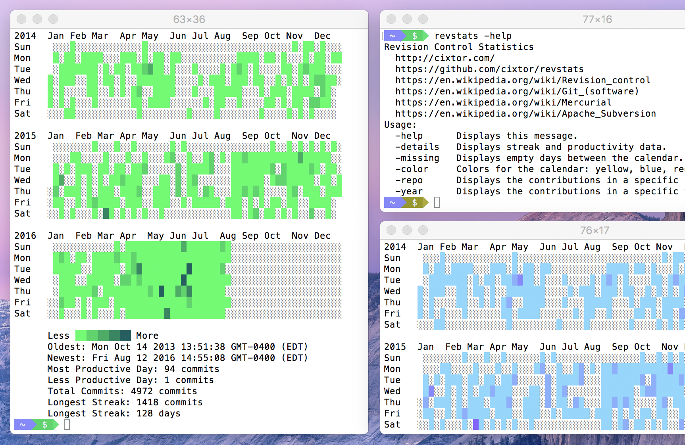

### Revision Control Statistics

GitHub introduced a calendar with the contributions associated to each user account [1] back in 2013. The contributions calendar shows how frequently you've been contributing over the past year. However, this only applies to contributions to public repositories hosted on GitHub, and as of May 19, 2016 they allowed private repositories too [2]. This also makes it easier to see what others are working on in your Organization. Any repositories you have in common with the profile you're viewing are shown in this list.

[1] https://github.com/blog/1360-introducing-contributions
[2] https://github.com/blog/2173-more-contributions-on-your-profile

But what about your contributions in private projects hosted in other services? This project aims to allow people to see their contributions int he same format as GitHub pointing the script to the directories where the private repositories reside in your computer's disk.



### Public Non-Code Contributions

GitHub not only counts the number commits and pull-requests but also when you open an issue. If you are using this tool offline it is be a good idea to include references to public issues that you have open so far.

- [x] _(2013-07-27)_ Kindari/laravel-markdown/issues/1
- [x] _(2013-08-14)_ nwjs/nw.js/issues/993
- [x] _(2013-08-15)_ appjs/appjs/issues/381

### License

```
The MIT License (MIT)

Copyright (c) 2016 CIXTOR

Permission is hereby granted, free of charge, to any person obtaining a copy
of this software and associated documentation files (the "Software"), to deal
in the Software without restriction, including without limitation the rights
to use, copy, modify, merge, publish, distribute, sublicense, and/or sell
copies of the Software, and to permit persons to whom the Software is
furnished to do so, subject to the following conditions:

The above copyright notice and this permission notice shall be included in all
copies or substantial portions of the Software.

THE SOFTWARE IS PROVIDED "AS IS", WITHOUT WARRANTY OF ANY KIND, EXPRESS OR
IMPLIED, INCLUDING BUT NOT LIMITED TO THE WARRANTIES OF MERCHANTABILITY,
FITNESS FOR A PARTICULAR PURPOSE AND NONINFRINGEMENT. IN NO EVENT SHALL THE
AUTHORS OR COPYRIGHT HOLDERS BE LIABLE FOR ANY CLAIM, DAMAGES OR OTHER
LIABILITY, WHETHER IN AN ACTION OF CONTRACT, TORT OR OTHERWISE, ARISING FROM,
OUT OF OR IN CONNECTION WITH THE SOFTWARE OR THE USE OR OTHER DEALINGS IN THE
SOFTWARE.
```
